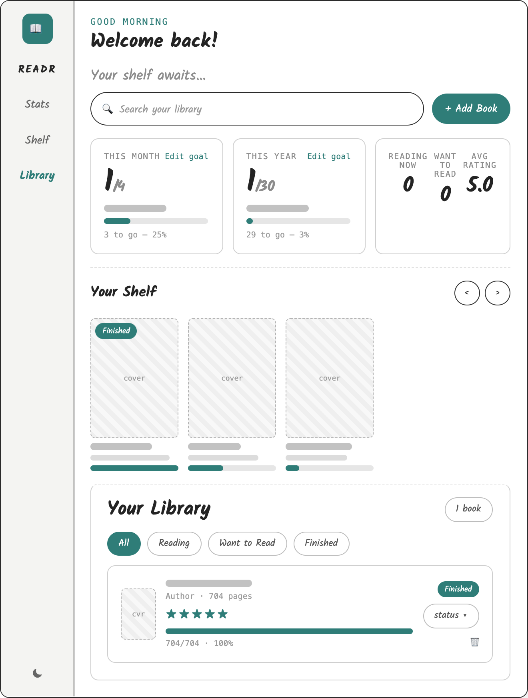
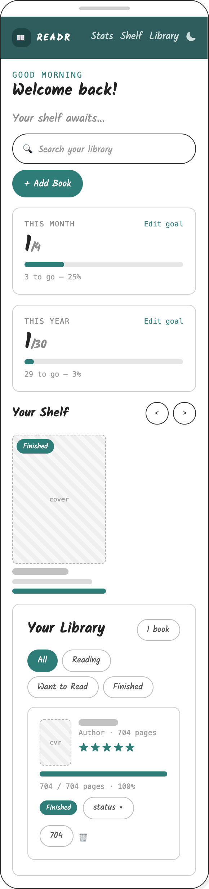
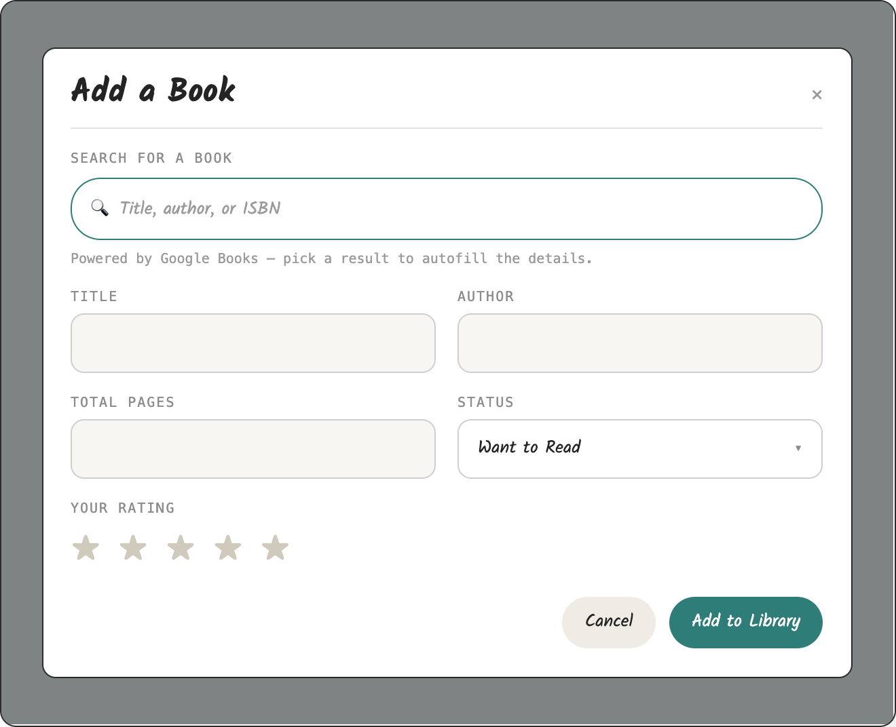

# Readr

Readr is a reading tracker interactive web application for people who love books but lose track of them. It lets readers build a personal library by searching the Google Books API: autofilling titles, authors, page counts, and cover art, then track their progress page by page, rate the books they finish, and set monthly and yearly reading goals with visual progress indicators. Everything is saved in the browser, so there are no accounts, no sign-ups; just a clean, fast way for casual readers to see what they're reading, what's next, and how close they are to their reading goals.

**Live site:** https://zsheerani1.github.io/Readr-/


---

## Table of Contents

1. [Purpose & Target Audience](#1-purpose--target-audience)
2. [User Stories](#2-user-stories)
3. [UX Design](#3-ux-design)
4. [Features](#4-features)
5. [Technologies Used](#5-technologies-used)
6. [Testing](#6-testing)
7. [Deployment](#7-deployment)
8. [Credits & Attribution](#8-credits--attribution)
9. [Acknowledgements](#9-acknowledgements)

---

## 1. Purpose & Target Audience

### 1.1 Purpose

Readr serves to address the gap between wanting to read more and actually keeping track of it.  Readers currently juggle several disconnected tools — an online bookshop search to find titles, a notes app to remember what they meant to read, and memory alone to track what they've finished — with no single place that synthesises all data points into a personal reading record. Existing alternatives fall short at opposite extremes: Goodreads is feature-heavy, cluttered with social features many readers don't want, and slow to search; while a plain notes list offers no book metadata, covers, or search. Readr sits between them, offering fast search across a large catalogue with a lightweight personal shelf, and nothing else.

### 1.2 Target Audience

Readr's primary audience is casual-to-regular readers aged roughly 18–40 who read between one and three books a month and want a low-friction way to track them. They are comfortable with web apps but not looking for a social network — they want to search a title, save it, and mark it as read without creating a profile or managing a feed. A secondary audience is students and book-club members who need to assemble and manage a reading list over a term or season. Both groups share the same core needs: fast search with reliable metadata, a persistent personal list, clear reading status, and an interface that works equally well on a phone and a laptop.

### 1.3 Rationale

I chose this project because it targets a problem I understand directly as a reader. A front-end web application is the appropriate solution for this audience because the app's value lies in speed and accessibility: users reach it instantly through a browser on any device with no installation, which suits a tool intended for quick, occasional interactions. Consuming an external API is the correct architectural decision because book metadata: titles, authors, ISBNs, cover images, publication data, is an enormous, constantly changing dataset that would be impractical and unnecessary to build and maintain myself. Delegating that to an established API lets development focus on the parts that create actual value for the user: the search experience, the personal shelf, and the interface. This also demonstrates the client-side skills the project is intended to evidence- asynchronous requests, handling API responses and error states, dynamic DOM rendering, and persisting user data on the client.

---

## 2. User Stories

**First-time visitor:**

- **US1:** As a user, I want to search for a book by title or author and see results with covers and key details, so that I can confirm I'm saving the right edition.
- **US2:** As a user, I want to navigate and operate the app by keyboard and with a screen reader, so that I can use it regardless of how I access the web.

**Returning reader:**

- **US3:** As a returning user, I want my saved books to still be there when I reopen the app, so that I don't have to rebuild my list each visit.
- **US4:** I want to mark a book as read, so that I can distinguish what I've finished from what I still plan to read.
- **US5:** I want to filter or view my shelf by reading status, so that I can see at a glance what I'm currently working through.
- **US6:** I want to remove a book from my shelf, so that my list stays relevant and uncluttered.
- **US7:** I want to rate books I have finished, so that I can
  remember which ones I enjoyed.
- **US8:** I want to see statistics about my reading over time, so that I can understand my habits and whether I'm reading more than before.
- **US9:** I want the app to remember my light/dark theme preference, so that it looks the way I left it every time I return.

---

## 3. UX Design

### 3.1 Design Process








### 3.2 Information Hierarchy & Navigation

The layout has two regions: a fixed sidebar for navigation and a scrolling main column for content. Keeping navigation always visible means every part of the app is one click away.
The sidebar holds the Readr wordmark at the top, then three links: Stats, Shelf and Library, ordered by how often they're used. The theme toggle sits at the bottom, separated from the links because it's a display preference, not a dstination.

The main column is ordered by priority for a returning user. A greeting confirms their data has loaded. 'Search and 'Add Book' come next, above the fold, because finding and adding books are the most frequent tasks. Three cards then show monthly progress, yearly progress and current reading activity, grouped together because they're read as one status summary. 

'Your Shelf' follows as a scrolling row of covers, giving a quick visual sense of the collection. The full library list comes last, as the most detailed view and the least often needed.

Hierarchy is carried by headings, type size and spacing rather than borders. Section headings are set in a larger serif face so the boundaries between sections are obvious at a glance. Each library row shows cover, title, author, rating, progress and status together, answering the likely questions about a book in one look.

'Status' appears as both a text label and a progress bar, not colour alone, so it stays readable for users who can't distinguish the colours.

The library filters rather than paginates. The controls: All, Reading, Want to Read, Finished, reuse the same three states used everywhere else in the app, keeping the vocabulary consistent.

### 3.3 Colour, Typography & Imagery

The interface is built on a warm neutral base rather than pure white: the page background is #f4f1ec, cards sit on #ffffff with a secondary surface of #faf8f5, and dividers use #e2dcd2. 

### Text 
Text runs from #1c1a17 for primary content through #6f675c for supporting text to #9c9387 for hints and metadata, giving three distinct levels of emphasis without introducing additional colours. 
The primary accent is a deep teal, #2b5f6e, used for the sidebar, primary buttons and headline figures; a brighter teal, #56dfda, marks interactive focus and star ratings. 

Three status colours carry meaning across the app: green #2f7d54 for finished books, amber #a3701a for want-to-read, and red #b23b2d for destructive actions such as deleting a book. Status is never signalled by colour alone (each status pill also carries a text label) so the information remains available to users who cannot distinguish the hues.

### Gradients. 
Gradients are used sparingly and only where they carry meaning. Progress bars fill with a left-to-right gradient from the primary teal #2b5f6e to the brighter accent #56dfda, so that progress reads as movement towards a lighter, more active colour rather than as a flat block. The same two colours form the diagonal gradient used on placeholder covers for books the API returns no image for, tying the fallback state visually to the rest of the interface. No gradient is used decoratively on surfaces, backgrounds or cards: flat colour keeps the interface calm and lets the book covers provide the visual interest.

### 3.4 Accessibility
- Semantic structure — HTML landmarks let screen reader users move between regions; a skip link, hidden until focused, bypasses the sidebar.
- Keyboard operable — all controls are native elements, so focus order and semantics come from the browser. :focus-visible gives a clear accent outline without showing it to mouse users.
- Never colour alone — status pills carry text labels, and progress is given as a page count as well as a bar.
- Scalable text — sizes in rem, so the interface responds to browser font settings; line height 1.55 for readability.
- Reduced motion — prefers-reduced-motion disables transitions and smooth scrolling. No autoplaying media; all state changes are user-initiated.


### 3.5 Design Decisions & Deviations

[Justify any deviations from convention, or state that none were made.]

---

## 4. Features

### 4.1 Existing Features

#### Dashboard & Reading Goals

[Description and the feedback the user receives.]


#### Add a Book (Google Books search)

[Description — debounced search, results with covers, autofill, manual
fallback, validation, confirmation toast.]


#### Your Library (list, filter, search)

[Description — cards, filter pills, live search, empty states.]


#### Reading Progress & Status

[Description — page input, automatic status changes, finish dates.]

#### Star Ratings

[Description — 1–5 rating, click current rating to clear, dashboard average.]

#### Carousel Shelf

[Description — scrolling shelf, arrow buttons, keyboard support.]

#### Dark / Light Theme

[Description — system preference, manual toggle, persistence.]

#### Persistence

[Description — localStorage for library, goals, and theme; graceful recovery
from invalid or unavailable storage.]

### 4.2 Future Features

- [e.g. Cross-device sync via a backend]
- [e.g. Reading streak tracking]
- [e.g. Export library as CSV]

---

## 5. Technologies Used

- **HTML5** — semantic page structure
- **CSS3** — custom properties, Grid and Flexbox, theming, responsive design
- **JavaScript (ES6+)** — all interactivity; no frameworks
- **[Google Books API](https://developers.google.com/books)** — book search,
  metadata, and cover images
- **[Jest](https://jestjs.io/)** — automated unit testing
- **Node.js / npm** — development dependencies only; the app runs with no
  build step
- **Git & GitHub** — version control
- **GitHub Pages** — deployment
- **VS Code** — editor
- **[W3C Markup Validator](https://validator.w3.org/),
  [W3C Jigsaw](https://jigsaw.w3.org/css-validator/), ESLint** — validation

---

## 6. Testing

### 6.1 Testing Principles: Manual vs Automated

[In your own words: what manual testing is, what automated testing is, the
strengths of each, when each is best deployed, and the split you chose for
this project and why.]

### 6.2 Automated Testing (Jest)

Unit tests cover the pure utility functions in `assets/js/utils.js`:

| Test file | Function under test | What is verified |
|---|---|---|
| `utils.test.js` | `secureUrl()` | `http://` cover URLs are upgraded to `https://`; empty input returns `''` |
| `utils.test.js` | `formatStatus()` | Known statuses map to display labels; unknown statuses fall through unchanged |
| `utils.test.js` | `generateId()` | Two consecutive calls return different values |

**Running the tests:**

```bash
npm install
npm test
```


[State which parts are not unit-tested (DOM rendering, event handling) and
that these are covered by the manual procedures below.]

### 6.3 Manual Testing Procedure & Results

| # | User story | Feature | Test action | Expected result | Actual result | Pass |
|---|---|---|---|---|---|---|
| T1 | US3 | Book search | Type "harry potter" in Add Book search | Results with covers appear after a short pause | | |
| T2 | US3 | Book search | Type a single character | No search fires; no results shown | | |
| T3 | US3 | Book search (failure) | Disconnect network, search | "Search unavailable" message; manual entry still works | | |
| T4 | US2 | Validation | Submit the form with an empty title | "Title is required." shown; book not added | | |
| T5 | US2 | Validation | Enter 0 or a negative page count | "Enter a valid number of pages." shown | | |
| T6 | US4 | Progress | Set current page equal to total pages | Status changes to Finished automatically | | |
| T7 | US4 | Progress | Enter a page number above the total | Value capped at total pages | | |
| T8 | US5 | Goals | Enter an invalid goal (0, blank, text) | Inline error; goal unchanged | | |
| T9 | US6 | Filtering | Click each filter pill | Only books with that status shown; active pill highlighted | | |
| T10 | US8 | Persistence | Add a book, refresh the page | Book still present | | |
| T11 | US10 | Theme | Toggle theme, refresh | Chosen theme persists | | |
| T12 | US1 | Navigation | Visit an invalid hash / URL | Redirected to the main page | | |
| T13 | — | Console | Perform all of the above with DevTools open | No errors in the console | | |

### 6.4 Responsiveness Testing

| Device / width | Browser | Result |
|---|---|---|
| iPhone SE (375px) | Safari | |
| iPad (768px) | Safari | |
| Desktop (1440px) | Chrome | |
| Desktop (1440px) | Firefox | |

[Include screenshots at each size in `docs/testing/`.]

### 6.5 Code Validation

| Validator | File(s) | Result |
|---|---|---|
| W3C Markup Validator | `index.html` | [No errors — screenshot](docs/testing/w3c-html.png) |
| W3C Jigsaw | `index.css` | [No errors — screenshot](docs/testing/jigsaw-css.png) |
| ESLint / JSLint | `assets/js/*.js` | [No major issues — screenshot](docs/testing/lint.png) |

### 6.6 Testing During Development

[Describe your ongoing routine: browser-testing each feature as built,
checking the console after user actions, running `npm test` before commits,
and after each deployment hard-refreshing the live site and running a smoke
test to confirm the deployed version matches development. Evidence in
`docs/testing/`.]

### 6.7 Bugs

**Fixed:**

| Bug | Cause | Fix |
|---|---|---|
| Theme toggle stopped working after adding an emoji button | Two elements shared `id="theme-toggle"`; `getElementById` attached the listener to the first only | Removed the duplicate so exactly one element owns the id |
| Title/Author fields misaligned in the Add Book modal | Grid cells of unequal height were vertically centred; error spans reserved inconsistent space | `align-items: start` on the form grid and a consistent `min-height` on error messages |
| `favicon.ico` 404 in the console on every page load | No favicon provided | Added a favicon and linked it in the head |

**Known / unfixed:**

[List honestly with an explanation, or state that no known bugs remain.]

---

## 7. Deployment

### 7.1 Deploying to GitHub Pages

1. On the repository page, go to **Settings → Pages**.
2. Under **Source**, select **Deploy from a branch**.
3. Select the **main** branch and the **/ (root)** folder, then **Save**.
4. Wait 1–2 minutes; the live URL appears at the top of the Pages settings.
5. Verify the live site loads and matches the development version.

The live site is available at:
[https://YOUR-USERNAME.github.io/Readr/](https://YOUR-USERNAME.github.io/Readr/)

### 7.2 Running the Project Locally

1. Clone the repository:
```bash
   git clone https://github.com/YOUR-USERNAME/Readr.git
   cd Readr
```
   (or download the ZIP from the green **Code** button and unzip it)
2. Open `index.html` directly in a browser, **or** serve it locally:
```bash
   python3 -m http.server 8000
```
   and visit `http://localhost:8000`.
3. To run the automated tests:
```bash
   npm install
   npm test
```

---

## 8. Credits & Attribution

### Code

- [Attribute code adapted from external sources — tutorials, articles,
  documentation — with a link and where it is used. Mirror each attribution
  in a comment above the relevant code.]
- [AI assistance: disclose here in accordance with the course's policy on AI
  tools, describing which parts of the project it contributed to.]

### Content & Media

- Book metadata and cover images are provided by the
  [Google Books API](https://developers.google.com/books).
- Icons are custom inline SVGs in the style of
  [Lucide](https://lucide.dev/) / [Feather](https://feathericons.com/).
- Fonts from [Google Fonts](https://fonts.google.com/): [list them].

---

## 9. Acknowledgements

- [Your tutor / mentor]
- [Friends or family who user-tested the app]
