# Readr

Readr is a reading tracker interactive web application for people who love books but lose track of them. It lets readers build a personal library by searching the Google Books API: autofilling titles, authors, page counts, and cover art, then track their progress page by page, rate the books they finish, and set monthly and yearly reading goals with visual progress indicators. Everything is saved in the browser, so there are no accounts, no sign-ups; just a clean, fast way for casual readers to see what they're reading, what's next, and how close they are to their reading goals.

**Live site:** https://zsheerani1.github.io/Readr-/


---

## Table of Contents

1. [Purpose & Target Audience](#1-purpose--target-audience)
2. [User Stories](#2-user-stories)
3. [UX Design](#3-ux-design)
4. [Features](#4-features)
5. [Technologies Used](#5-technologies-used)
6. [Testing](#6-testing)
7. [Deployment](#7-deployment)
8. [Credits & Attribution](#8-credits--attribution)
9. [Acknowledgements](#9-acknowledgements)

---

## 1. Purpose & Target Audience

### 1.1 Purpose

Readr serves to address the gap between wanting to read more and actually keeping track of it.  Readers currently juggle several disconnected tools — an online bookshop search to find titles, a notes app to remember what they meant to read, and memory alone to track what they've finished — with no single place that synthesises all data points into a personal reading record. Existing alternatives fall short at opposite extremes: Goodreads is feature-heavy, cluttered with social features many readers don't want, and slow to search; while a plain notes list offers no book metadata, covers, or search. Readr sits between them, offering fast search across a large catalogue with a lightweight personal shelf, and nothing else.

### 1.2 Target Audience

Readr's primary audience is casual-to-regular readers aged roughly 18–40 who read between one and three books a month and want a low-friction way to track them. They are comfortable with web apps but not looking for a social network — they want to search a title, save it, and mark it as read without creating a profile or managing a feed. A secondary audience is students and book-club members who need to assemble and manage a reading list over a term or season. Both groups share the same core needs: fast search with reliable metadata, a persistent personal list, clear reading status, and an interface that works equally well on a phone and a laptop.

### 1.3 Rationale

I chose this project because it targets a problem I understand directly as a reader. A front-end web application is the appropriate solution for this audience because the app's value lies in speed and accessibility: users reach it instantly through a browser on any device with no installation, which suits a tool intended for quick, occasional interactions. Consuming an external API is the correct architectural decision because book metadata: titles, authors, ISBNs, cover images, publication data, is an enormous, constantly changing dataset that would be impractical and unnecessary to build and maintain myself. Delegating that to an established API lets development focus on the parts that create actual value for the user: the search experience, the personal shelf, and the interface. This also demonstrates the client-side skills the project is intended to evidence- asynchronous requests, handling API responses and error states, dynamic DOM rendering, and persisting user data on the client.

---

## 2. User Stories

**First-time visitor:**

- **US1:** As a user, I want to search for a book by title or author and see results with covers and key details, so that I can confirm I'm saving the right edition.
- **US2:** As a user, I want to navigate and operate the app by keyboard and with a screen reader, so that I can use it regardless of how I access the web.

**Returning reader:**

- **US3:** As a returning user, I want my saved books to still be there when I reopen the app, so that I don't have to rebuild my list each visit.
- **US4:** I want to mark a book as read, so that I can distinguish what I've finished from what I still plan to read.
- **US5:** I want to filter or view my shelf by reading status, so that I can see at a glance what I'm currently working through.
- **US6:** I want to remove a book from my shelf, so that my list stays relevant and uncluttered.
- **US7:** I want to rate books I have finished, so that I can
  remember which ones I enjoyed.
- **US8:** I want to see statistics about my reading over time, so that I can understand my habits and whether I'm reading more than before.
- **US9:** I want the app to remember my light/dark theme preference, so that it looks the way I left it every time I return.

---

## 3. UX Design

### 3.1 Design Process


### 3.2 Information Hierarchy & Navigation

The layout has two regions: a fixed sidebar for navigation and a scrolling main column for content. Keeping navigation always visible means every part of the app is one click away.
The sidebar holds the Readr wordmark at the top, then three links: Stats, Shelf and Library, ordered by how often they're used. The theme toggle sits at the bottom, separated from the links because it's a display preference, not a dstination.

The main column is ordered by priority for a returning user. A greeting confirms their data has loaded. 'Search and 'Add Book' come next, above the fold, because finding and adding books are the most frequent tasks. Three cards then show monthly progress, yearly progress and current reading activity, grouped together because they're read as one status summary. 

'Your Shelf' follows as a scrolling row of covers, giving a quick visual sense of the collection. The full library list comes last, as the most detailed view and the least often needed.

Hierarchy is carried by headings, type size and spacing rather than borders. Section headings are set in a larger serif face so the boundaries between sections are obvious at a glance. Each library row shows cover, title, author, rating, progress and status together, answering the likely questions about a book in one look.

'Status' appears as both a text label and a progress bar, not colour alone, so it stays readable for users who can't distinguish the colours.

The library filters rather than paginates. The controls: All, Reading, Want to Read, Finished, reuse the same three states used everywhere else in the app, keeping the vocabulary consistent.

### 3.3 Colour, Typography & Imagery

The interface is built on a warm neutral base rather than pure white: the page background is #f4f1ec, cards sit on #ffffff with a secondary surface of #faf8f5, and dividers use #e2dcd2. 

### Text 
Text runs from #1c1a17 for primary content through #6f675c for supporting text to #9c9387 for hints and metadata, giving three distinct levels of emphasis without introducing additional colours. 
The primary accent is a deep teal, #2b5f6e, used for the sidebar, primary buttons and headline figures; a brighter teal, #56dfda, marks interactive focus and star ratings. 

Three status colours carry meaning across the app: green #2f7d54 for finished books, amber #a3701a for want-to-read, and red #b23b2d for destructive actions such as deleting a book. Status is never signalled by colour alone (each status pill also carries a text label) so the information remains available to users who cannot distinguish the hues.

### Gradients. 
Gradients are used sparingly and only where they carry meaning. Progress bars fill with a left-to-right gradient from the primary teal #2b5f6e to the brighter accent #56dfda, so that progress reads as movement towards a lighter, more active colour rather than as a flat block. The same two colours form the diagonal gradient used on placeholder covers for books the API returns no image for, tying the fallback state visually to the rest of the interface. No gradient is used decoratively on surfaces, backgrounds or cards: flat colour keeps the interface calm and lets the book covers provide the visual interest.

### 3.4 Accessibility
- Semantic structure — HTML landmarks let screen reader users move between regions; a skip link, hidden until focused, bypasses the sidebar.
- Keyboard operable — all controls are native elements, so focus order and semantics come from the browser. :focus-visible gives a clear accent outline without showing it to mouse users.
- Never colour alone — status pills carry text labels, and progress is given as a page count as well as a bar.
- Scalable text — sizes in rem, so the interface responds to browser font settings; line height 1.55 for readability.
- Reduced motion — prefers-reduced-motion disables transitions and smooth scrolling. No autoplaying media; all state changes are user-initiated.


### 3.5 Design Decisions & Deviations

None were made.

---

## 4. Features

### 4.1 Existing Features

#### Dashboard & Reading Goals

The dashboard opens with a time-of-day greeting and three cards summarising the user's reading: progress towards a monthly goal, progress towards a yearly goal, and a summary of books currently being read, books wanted, and average rating. Each goal card shows the count against the target, a progress bar, and a line stating how many books remain and what percentage of the goal is complete, so progress is readable at a glance rather than requiring calculation. Goals are edited through a modal and update immediately.


#### Add a Book (Google Books search)

Books are added through a modal that searches the Google Books API. Typing a title, author or ISBN triggers a search after a short pause rather than on every keystroke, reducing unnecessary requests; results appear with cover, title and author so the correct edition can be identified before selecting. Choosing a result autofills the title, author, page count and cover. Every field remains editable, and a book can be entered entirely by hand if it isn't found or the API is unavailable. The form validates before submitting, showing inline messages for missing or invalid values, and a confirmation toast appears once the book is added.

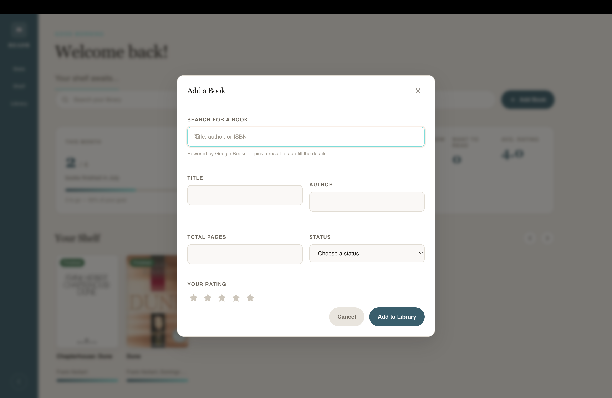

#### Your Library (list, filter, search)

The library lists every book as a row showing cover, title, author, page count, rating, reading progress and status. Filter pills switch between all books and each reading status, with the active filter highlighted. 

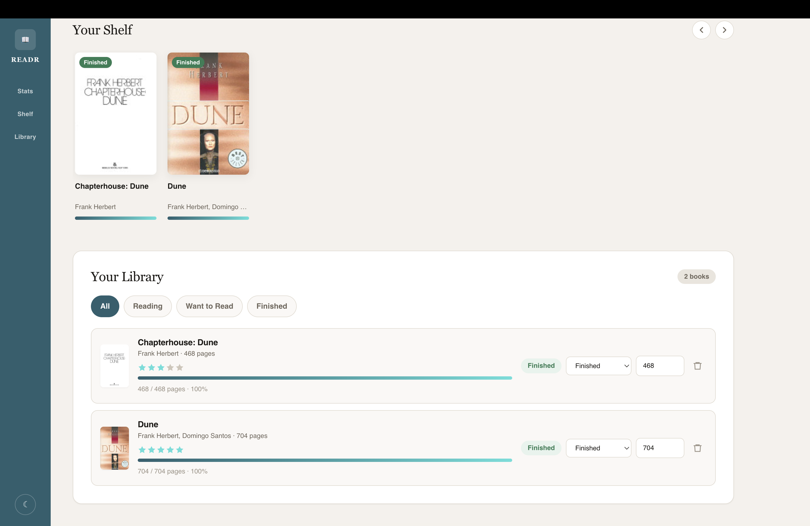

#### Reading Progress & Status

Each book records a current page against its total, shown as a progress bar and a percentage. Updating the page count updates progress immediately, and setting the current page to the total marks the book as finished automatically, so the two never fall out of step. Status can also be changed directly from the library row.

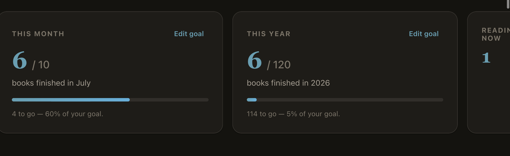

#### Star Ratings

Books can be rated from one to five stars. Clicking the current rating again clears it, so a rating can be removed without deleting the book. Ratings feed the average shown on the dashboard.

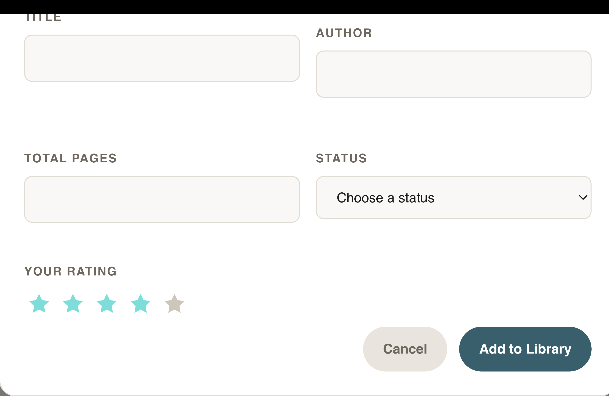

#### Carousel Shelf

Arrow buttons scroll it on desktop, touch swipe on mobile, and the track is keyboard focusable so it can be scrolled without a mouse. Each cover carries a status badge, and books without a cover from the API display a generated placeholder rather than a gap.

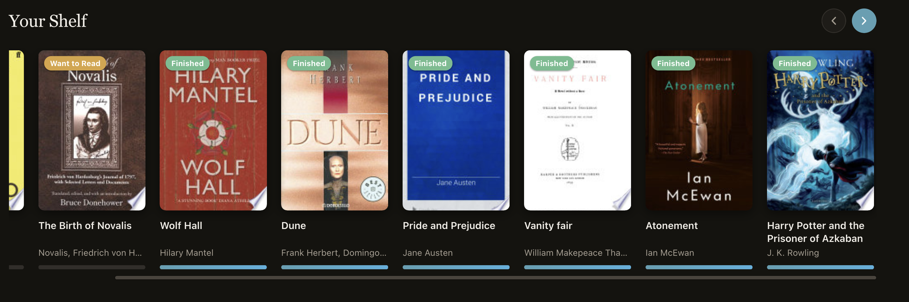

#### Dark/Light Theme

A manual toggle switches between light and dark mode.

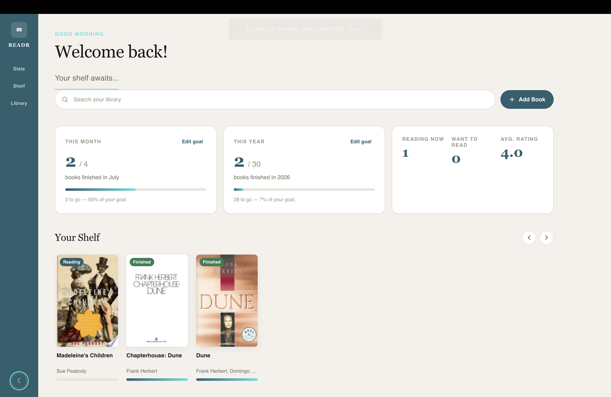

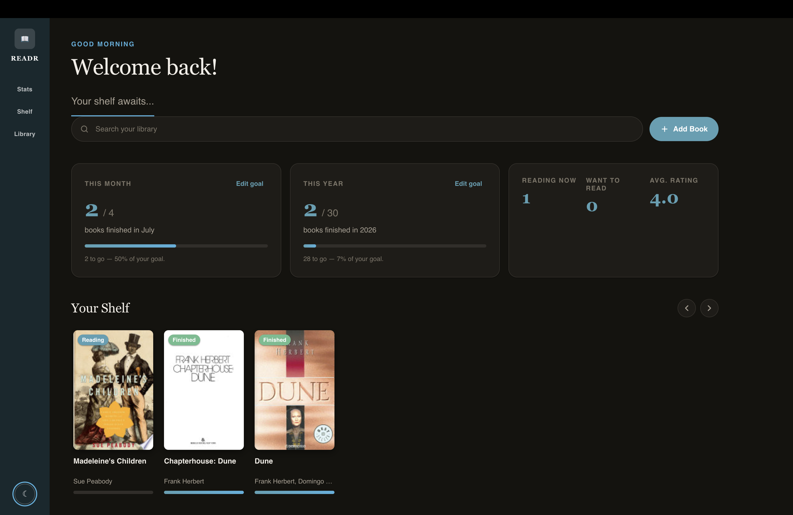


#### Persistence

The library, goals and theme preference are stored in the browser's localStorage, so everything is restored on return without an account or login. Data is held per browser and per device, and does not sync across devices; cross-device sync is listed as a future feature.

#### Accessibility 

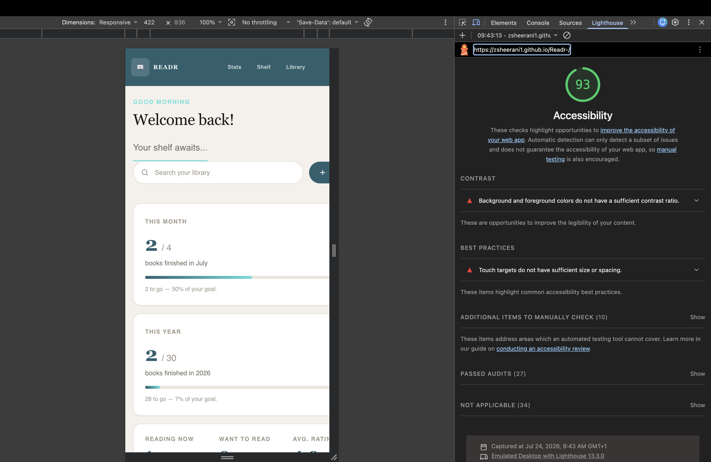


### 4.2 Future Features

- **Reading sessions and streaks** — logging pages read per day rather than only current position, enabling streaks and a reading-pace estimate.
- **Notes and quotes per book** — a place to record thoughts while reading, which is the most common reason readers keep a separate notes app alongside a tracker.
- **Export and import** — download the library as CSV or JSON, both as a backup against the single-device limitation and to allow migration from Goodreads.
- **Custom shelves and tags** — user-defined groupings beyond the three reading statuses, for genres, series or book clubs.
- **Automated unit tests** — extracting the data-handling and validation logic into exported modules so it can be tested with Jest, currently prevented by the code being scoped inside the initialisation callback.

---

## 5. Technologies Used

- **HTML5** — semantic page structure
- **CSS3** — custom properties, Grid and Flexbox, theming, responsive design
- **JavaScript (ES6+)** — all interactivity; no frameworks
- **[Google Books API](https://developers.google.com/books)** — book search,
  metadata, and cover images
- **Git & GitHub** — version control
- **GitHub Pages** — deployment
- **VS Code** — editor
- **[W3C Markup Validator](https://validator.w3.org/),
  [W3C Jigsaw](https://jigsaw.w3.org/css-validator/),
- **[JSHint](https://jshint.com/)

---

## 6. Testing

### 6.1 Testing Principles: Manual vs Automated

Manual testing entails a person using the application and checking the result against what was expected, and automated testing means writing code that tests code, which is slower to set up but can be re-run instantly on every change. 

Manual testing is better for judgement-based checks like layout, responsiveness and usability, while automation suits stable logic with clear inpts and outputs, particularly on larger or longer-lived projects where regressions are a risk. Readr was tested manually, because it is a small front-end application whose behaviour is mostly interface interaction and can be fully exercised by hand in a few minutes; automated unit tests on the data-handling functions are identified as the next step, and would require extracting that logic into exported modules first.


### 6.3 Manual Testing Procedure & Results

| # | User story | Feature | Test action | Expected result | Actual result | Pass |
|---|---|---|---|---|---|---|
| T1 | US3 | Book search | Type "harry potter" in Add Book search | Results with covers appear after a short pause | As expected | Pass |
| T2 | US3 | Book search | Type a single character | No search fires; no results shown | As expected | Pass |
| T3 | US3 | Book search (failure) | Disconnect network, search | "Search unavailable" message; manual entry still works | As expected | Pass |
| T4 | US2 | Validation | Submit the form with an empty title | "Title is required." shown; book not added | As expected | Pass |
| T5 | US2 | Validation | Enter 0 or a negative page count | "Enter a valid number of pages." shown | As expected  | Pass |
| T6 | US4 | Progress | Set current page equal to total pages | Status changes to Finished automatically | As expected | Pass |
| T7 | US4 | Progress | Enter a page number above the total | Value capped at total pages | As expected | Pass |
| T8 | US5 | Goals | Enter an invalid goal (0, blank, text) | Inline error; goal unchanged | As expected | Pass |
| T9 | US6 | Filtering | Click each filter pill | Only books with that status shown; active pill highlighted | As expected | Pass |
| T10 | US8 | Persistence | Add a book, refresh the page | Book still present | As expected | Pass |
| T11 | US10 | Theme | Toggle theme, refresh | Chosen theme persists | As expected | Pass |
| T12 | US1 | Navigation | Visit an invalid hash / URL | Redirected to the main page | As expected |Pass |
| T13 | — | Console | Perform all of the above with DevTools open | No errors in the console | As expected | Pass |

### 6.4 Responsiveness Testing

| Device / width | Browser | Result |
|---|---|---|
| iPhone SE (375px) | Google Chrome | 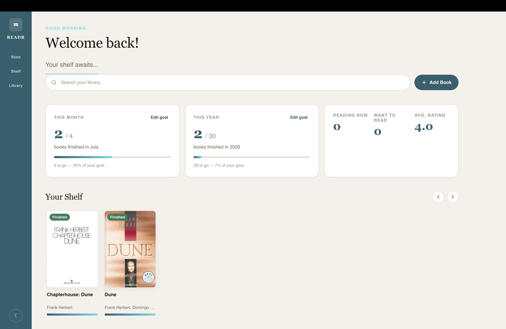 |
| iPad (768px) | Firefox | 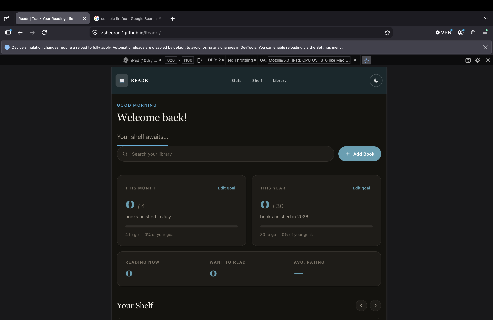 |
| Desktop (1440px) | Chrome |  |
| Desktop (1440px) | Firefox | 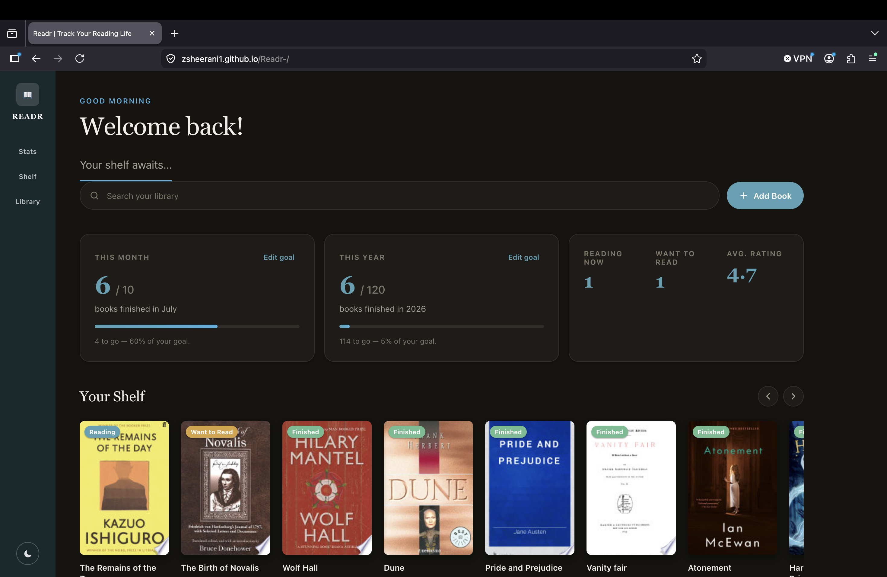 |


### 6.5 Code Validation

| Validator | File(s) | Result |
|---|---|---|
| W3C Markup Validator | `index.html` | 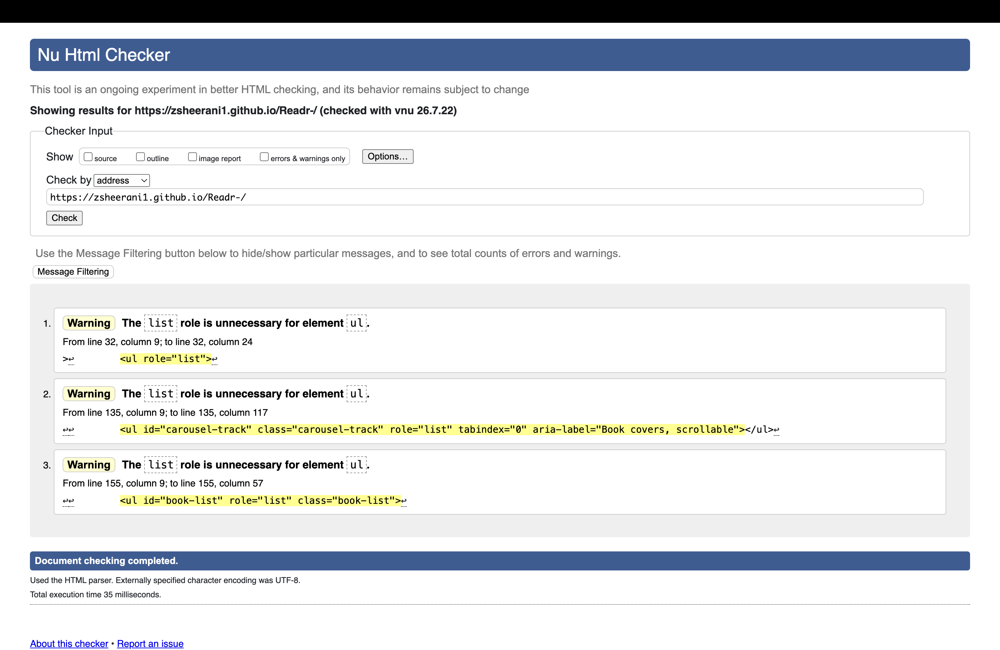 |
| W3C Jigsaw | `index.css` | 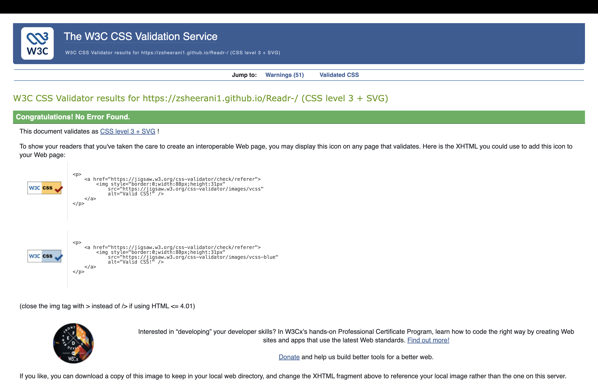 |
| JSHint | `assets/js/*.js` | 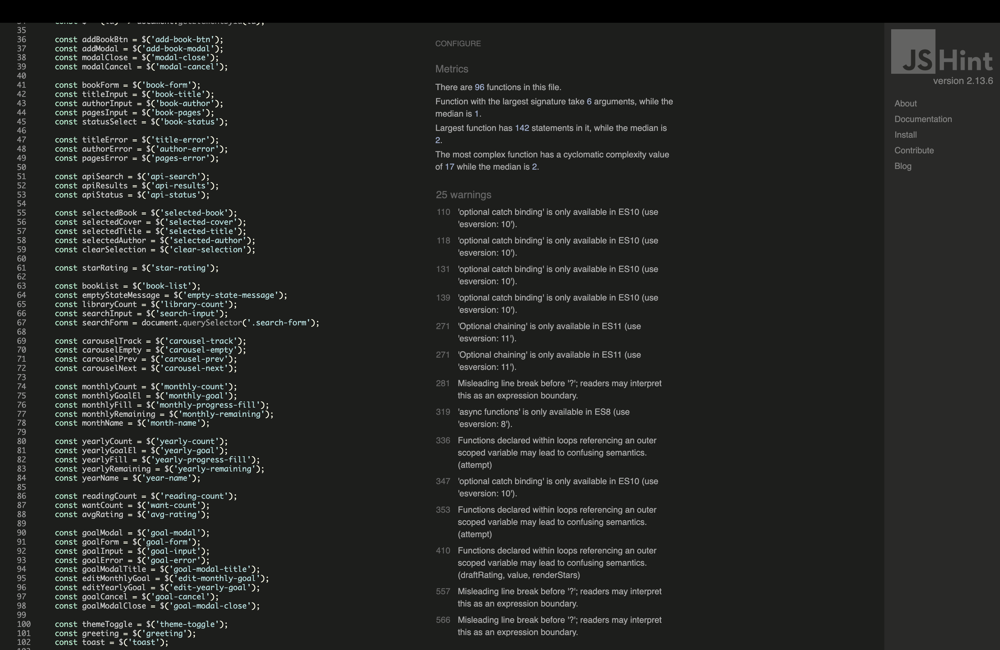

### 6.6 Testing During Development

- Testing ran alongside development rather than at the end. Each feature was tested in the browser as it was built, with DevTools open throughout: the console checked after every user action, and the Application tab used to confirm data was persisting correctly.
Work was committed after each feature or fix, so there was always a working version to return to. This mattered when an editing error introduced a duplicate variable declaration and stopped the whole script running; the console identified the line, and the previous commit gave a reference point for the fix.

- Validation was routine. The W3C and JSHint validators caught faults that browser testing had not, including a duplicate element ID and an invalid image src.

- After each deployment, the live site was hard-refreshed and a short smoke test run: load the page, add a book, change its status, refresh, to confirm the deployed version matched development. This was necessary because relative paths and cached assets behave differently once hosted; broken asset paths were in fact found this way.

### 6.7 Bugs

**Fixed:**
### Bug: Google Books search returning "Search unavailable"
Every search returned the "Search unavailable" message instead of results. The console showed the API was rejecting the request rather than the network failing, which pointed to a configuration fault rather than a code fault. The cause was the API key's referrer restrictions not matching the origin the reqests came from.
Removing the restriction fixed the search but left the key open to any site- not acceptable for a key in a public repository. It was instead restricted to the deployed GitHub Pages domain and limited to the Books API only, then retested on the live site.
The bug also confirmed the error handling works: the failed request was caught, the user was shown a message, and manual entry still worked rather than the interface failing silently.

### Bug: The SyntaxError that stopped the script running.
Duplicate const STORAGE_KEY declaration introduced while editing; the whole file failed to parse so the app rendered as static HTML with no functionality. Found via the console (Unexpected token ']', then the duplicate declaration), fixed by reverting to the working version.

### Bug: Invalid HTML found by validation, not by testing. 
A stray </span>, an empty src="", a required select with no placeholder option, and role="tab" used without matching tabpanels. All invisible in the browser — the app worked fine — but caught by the W3C validator. Worth noting explicitly that these were found by validation rather than functional testing, since that shows why you ran both.

### Bug: Non-breaking spaces in the JavaScript.
Invisible characters introduced by copy-pasting, flagged by JSHint as Unexpected '£'. Harmless at runtime but caught by linting.

**Known / unfixed:**

### Bug: Single large render function. 
Linting metrics showed one function containing 142 statements with a complexity of 17, against a median of 2 across the file. It works correctly, but would be more readable and easier to maintain if split into separate functions per section. This was left unchanged to avoid introducing breakage late in development, and is identified as the main refactoring priority.

## 7. Deployment

### 7.1 Deploying to GitHub Pages

1. On the repository page, go to **Settings → Pages**.
2. Under **Source**, select **Deploy from a branch**.
3. Select the **main** branch and the **/ (root)** folder, then **Save**.
4. Wait 1–2 minutes; the live URL appears at the top of the Pages settings.
5. Verify the live site loads and matches the development version.


### 7.2 Running the Project Locally

1. Clone the repository:
```bash
 git clone https://github.com/zsheerani1/Readr-.git
cd Readr-
```
   (or download the ZIP from the green **Code** button and unzip it)
2. Open `index.html` directly in a browser, **or** serve it locally:
```bash
   ppython3 -m http.server 8000
```
   and visit `http://localhost:8000`.
```

---

## 8. Credits & Attribution

### Code

- The three-state reading model (want to read / reading / finished) is a convention established by [Goodreads](https://www.goodreads.com/) and [The StoryGraph](https://thestorygraph.com/).
- - AI assistance (Claude, Anthropic) was used during this project in the following ways: generating the wireframe diagrams in `assets/wireframes/` from my own layout decisions; creating the template of this README, which I populated diagnosing and correcting HTML validation errors; interpreting linter and validator output. All application code was written and tested by me, and all testing results recorded in this document are my own observations.

### Content & Media

- Book metadata and cover images are provided by the
  [Google Books API](https://developers.google.com/books).
- - Fonts from [Google Fonts](https://fonts.google.com/): [Fraunces](https://fonts.google.com/specimen/Fraunces) for headings and [Work Sans](https://fonts.google.com/specimen/Work+Sans) for body text.

---

## 9. Acknowledgements

- Len Johnson
